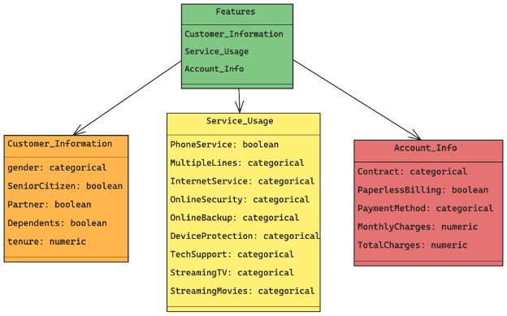

**Business Context:**

The goal of this project is to develop a machine learning system that predicts customer churn for a telecommunications company based on customer attributes and usage patterns.

Churn is defined as whether a customer leaves the company. This is a binary classification problem (Churn: Yes/No).

The solution will provide insights into factors contributing to customer churn and enable the business to improve retention strategies. By proactively addressing churn risks, the company can reduce revenue loss.

**Objectives:**

- Predict if a customer will churn based on their behavior and demographic data.
- Understand key factors that influence customer retention.
- Develop targeted intervention strategies to improve customer satisfaction.

**Key Stakeholders**

**Marketing Team:** For customer retention and targeted campaigns.

**Customer Support:** To enhance customer satisfaction based on identified risk factors.

**Management:** For strategic decision-making on reducing churn rates. **Data Science Team:** To build, evaluate, and improve predictive models.

**Dataset Details:**

The dataset contains various features related to customer information, usage behavior, and service details. Here is a representation of the dataset features:

**Technologies are used**
DVC ( Data Versioning), Feature Store (Feature Maintainance), MLflow (ML tracking), Scikit Learn, Flask (API management)
